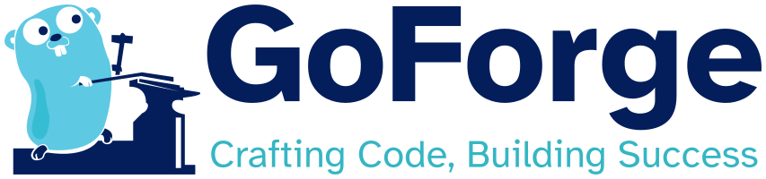

# GoForge

## Brand and Trademark Usage Guidelines

### Trademark Guidelines

Any use of the GoForge Trademarks other than those permitted in these
guidelines must be approved in advance.

In general, we want the word mark "GoForge" and the GoForge Slogan,
\"Crafting Code, Building Success\" when associated therewith, to be
used freely to refer to the GoForge programming language and its
purpose.

We do not want the word mark \"GoForge\" to be used:

-   to refer to any other command line tool.
-   in a way that is misleading or may imply association of unrelated
    projects, companies, software, documentation, or other resources
    with the GoForge project.
-   in ways that confuse the community as to whether the GoForge command
    line tool is open source and free to use.

These guidelines exist to ensure that the GoForge command line tool can
continue to share its releases under open source licenses while making
sure that the GoForge Trademarks are protected as meaningful source
identifiers in a way that's consistent with trademark law.

### License

The GoForge command line tool is licensed under the [Eclipse Public
License - v 2.0](https://www.eclipse.org/legal/epl-2.0/). Any use,
reproduction or distribution of the program constitutes recipient\'s
acceptance of said license.

### Nominative Fair Use

GoForge is neither affiliated with, nor endorsed by the Go programming
language community or Google.

### No Implication of Official Status

Use of the name \"GoForge\" does not imply official status or
endorsement by the Go programming language product.

### Logo

The Go Gopher was originally created by Renee French and is licensed
under the [Creative Commons 4.0 Attribution
License](https://creativecommons.org/licenses/by/4.0/). Consequently,
the GoForge logo is also licensed under the [Creative Commons 4.0
Attribution License](https://creativecommons.org/licenses/by/4.0/),
which allows you to use, share, and adapt the logo as long as you
provide appropriate attribution. However, please note that the GoForge
name and slogan are proprietary and owned by goforge.dev. Any use of the
GoForge name and slogan must be in accordance with their terms and
policies.

## Inspired by

-   Mix: a build tool for Elixir that creates, compiles, tests, manages
    dependencies, and much more.
-   Polylith: a framework for architecting composable projects in a
    variety of languages
-   Leiningen: a project automation framework for Clojure
-   Cobra: a Go framework for making CLI apps
-   Viper: a Go library for configuration management
-   Maven and Gradle: build automation and project management tools for
    Java

## Why use GoForge?

-   Straightforward way to make composable code in Go.
-   See what\'s going on in a project at a glance.
-   Straightforward commands to make and extend a project.
-   Straightforward commands to make and version artifacts.
-   Plays nicely with Git & GitHub.
-   Plays nicely with Cobra.
-   Plays nicely with Viper.

## How to use GoForge?

\`\`\`bash goforge new project \<git user account\>/\<project name\>

# OR

goforge new project \<website\>/\<project name\>

# OR

goforge new project \<website\>/\<path/to/project name\> \`\`\`

\`\`\`bash goforge new component \<component name\> \`\`\`

\`\`\`bash goforge new base \<base name\> \`\`\`

\`\`\`bash goforge new app \<app name\>

# OR

goforge new app --cobra \<app name\> \`\`\`

## Commands

### Show

1.  Components

    1.  All

    2.  For a particular app

    3.  For a particular base

2.  Bases

    1.  All

    2.  For a particular app

    3.  Using a particular component

3.  Apps

    1.  All

    2.  Using a particular base

    3.  Using a particular component

4.  Deps

    1.  All

    2.  For a particular component

    3.  For a particular base

    4.  For a particular app

### New

With each new entity, it should be added to Git.

1.  Project

2.  Component

3.  Base

4.  App

### Build

1.  App

2.  All Apps

### Clean

1.  All

2.  App

### Test

1.  Component

2.  All Components

3.  Base

4.  All Bases

5.  App

6.  All Apps

### Tag

### Bump

1.  Major

2.  Minor

3.  Patch

### Release

Build, Test, Tag

1.  Major

2.  Minor

3.  Patch

## TODO

-   Make GoForge compatible with GitHub Actions
